# enhanced_ecommerce_app
 Email authentication , product CRUD operations, and essential user actions like cart management, checkout, and selling.
Integrated a responsive app notification system for enhanced user communication.
## Tools

- Authentication: Email -PHP REST APIs
- Backend: PHP- MYSQL
- State management: Cubit

- Packages:
  - get_it
  - equatable
  - fluttertoast
  - easy_localization
  - firebase_messaging
  - uuid
  - flutter_screenutil
  - flutter_launcher_icons
  - pin_code_fields
  - cached_network_image
  - shared_preferences
  
## Screenshots
<table>
  <tr>
    <td>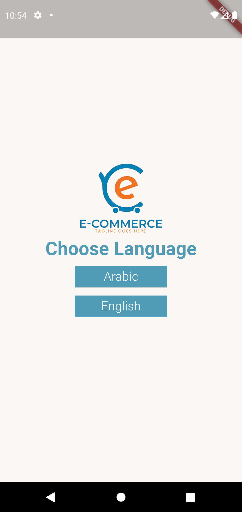</td>
     <td>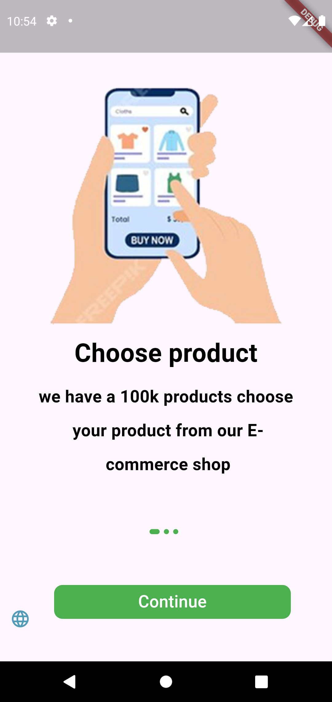</td>
     <td></td>
  </tr>
 <tr>
  <td>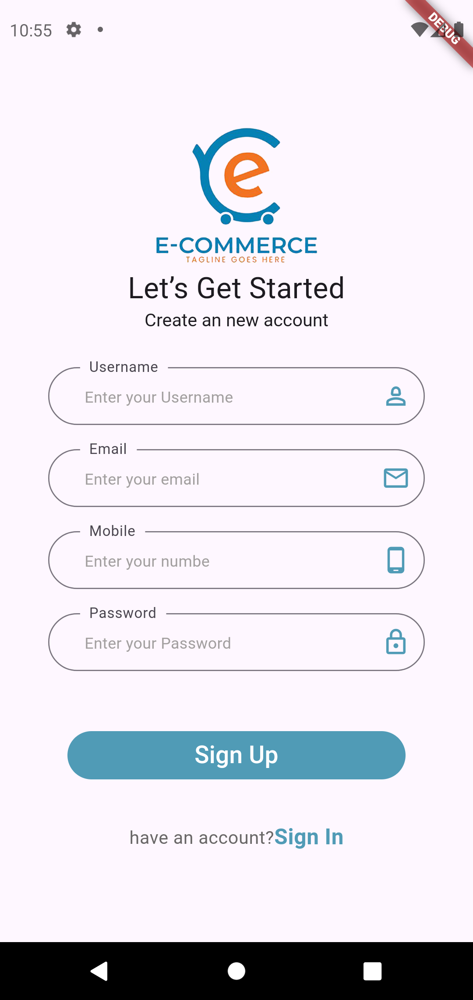</td>
    <td>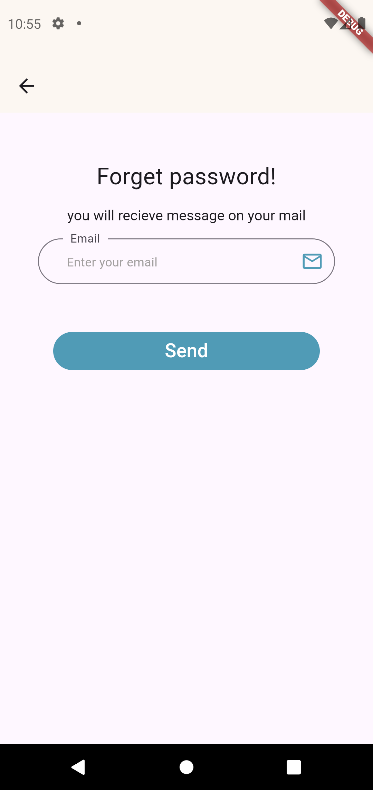</td>
     <td>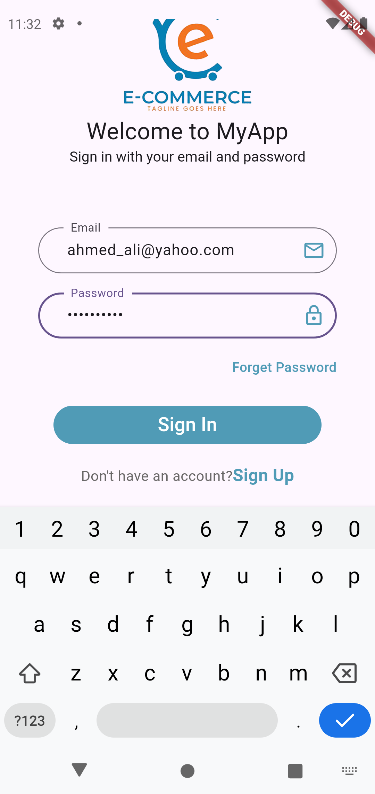</td>
    </tr>
  
     <tr>
  <td>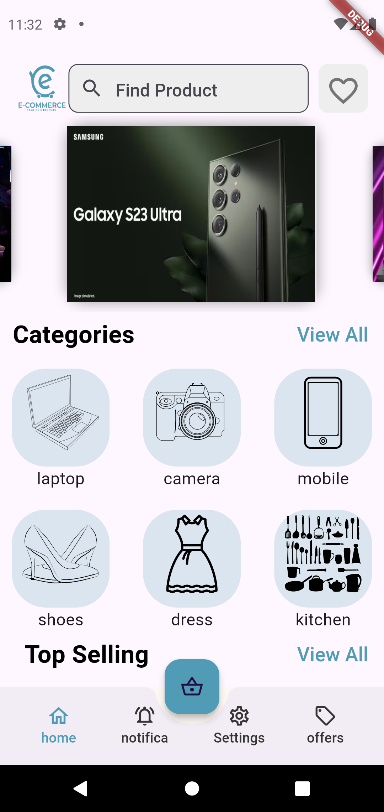</td>
    <td>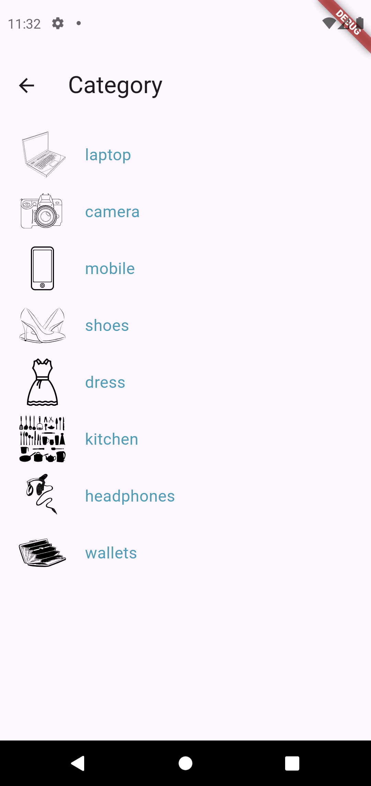</td>
     <td>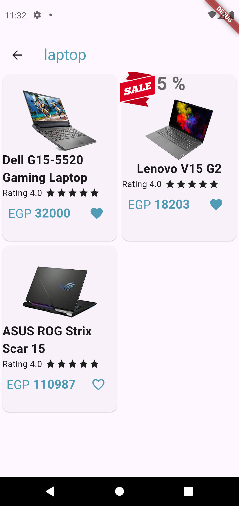</td>
    </tr>

     <tr>
  <td>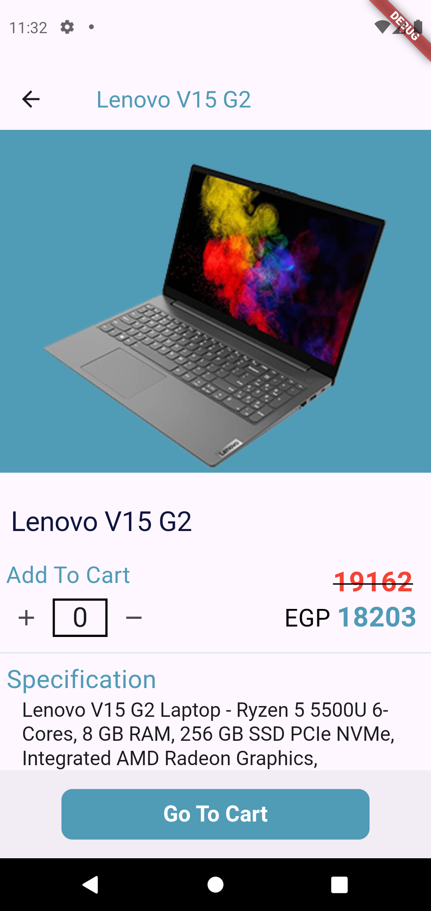</td>
    <td>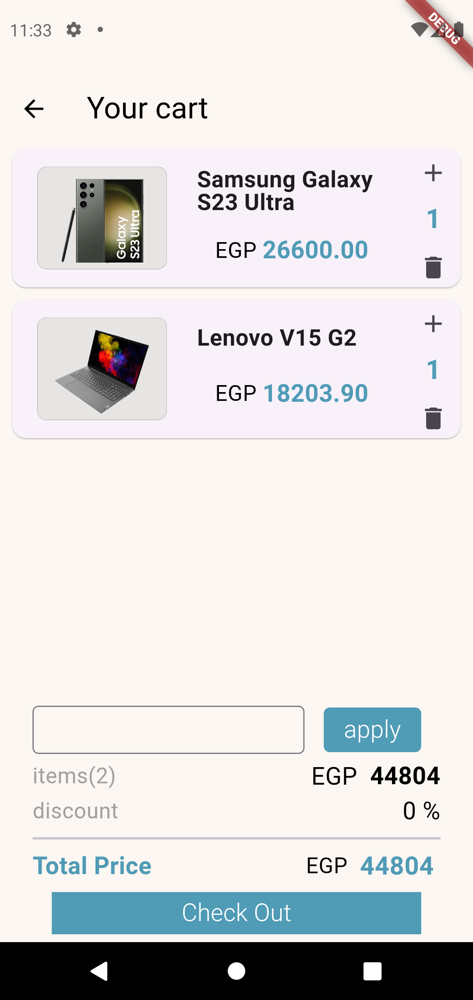</td>
     <td>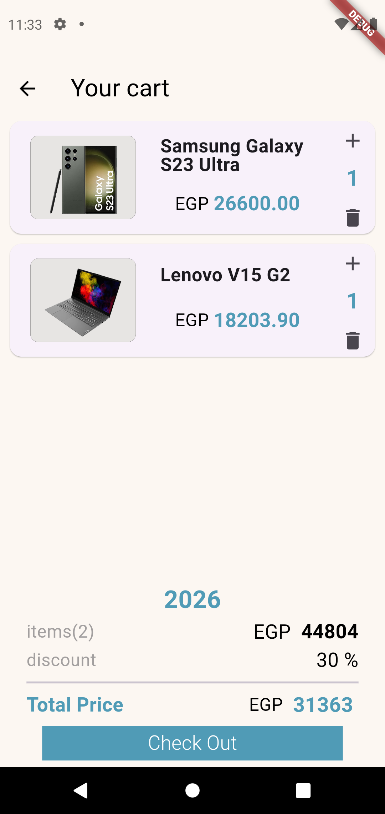</td>
    </tr>

 <tr>
  <td>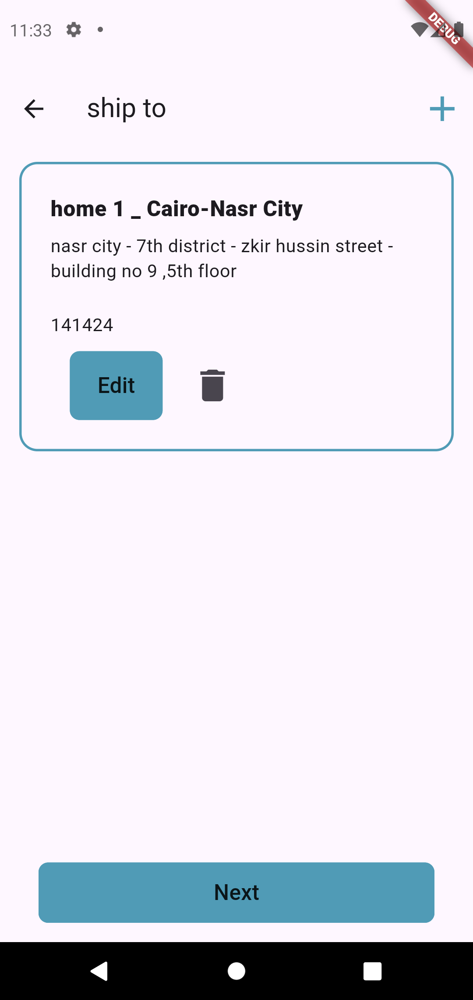</td>
    <td>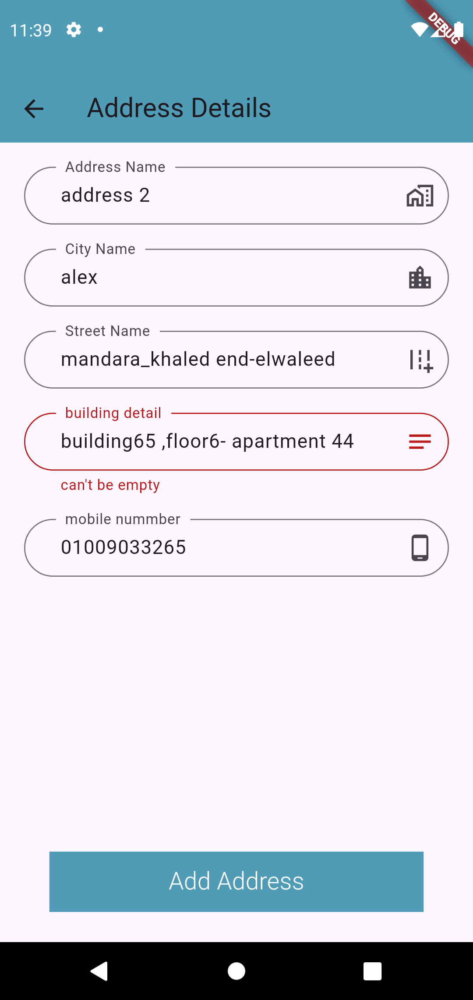</td>
     <td>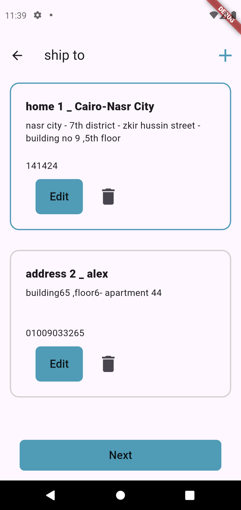</td>
    </tr>

 <tr>
  <td>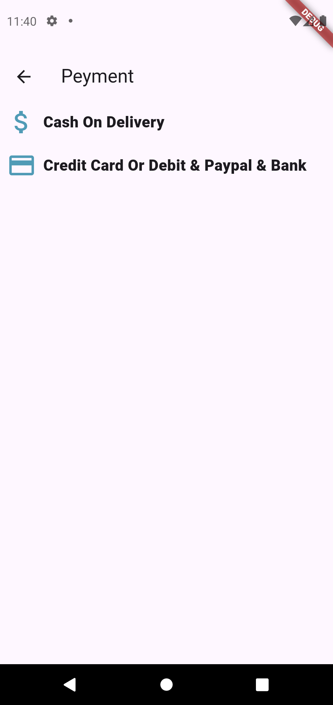</td>
    <td>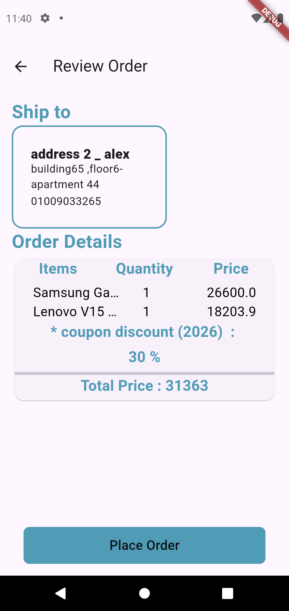</td>
     <td>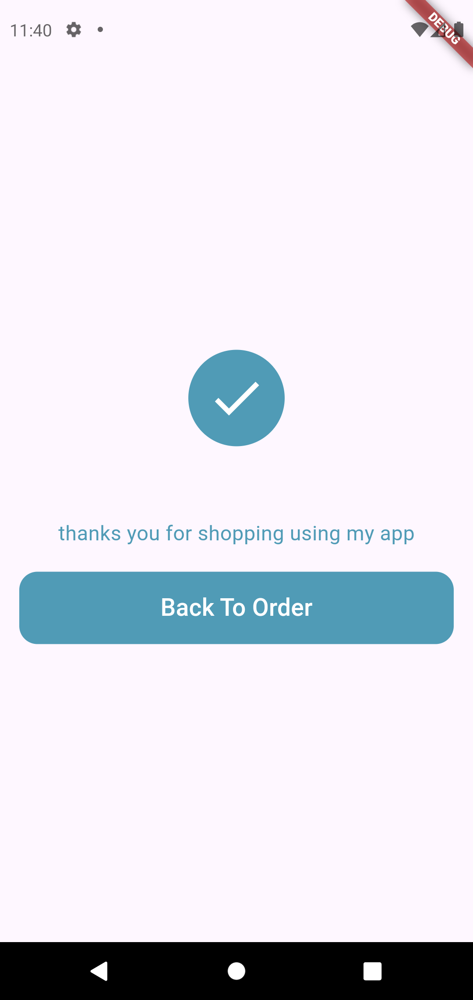</td>
    </tr>

  <tr>
  <td>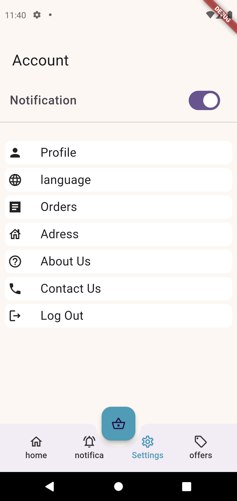</td>
    <td>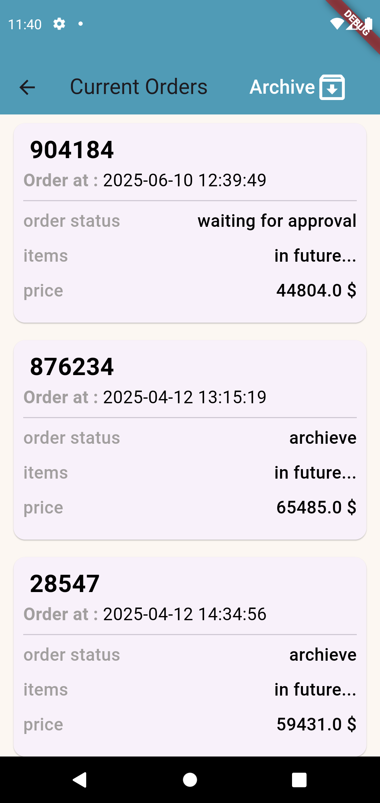</td>
     <td>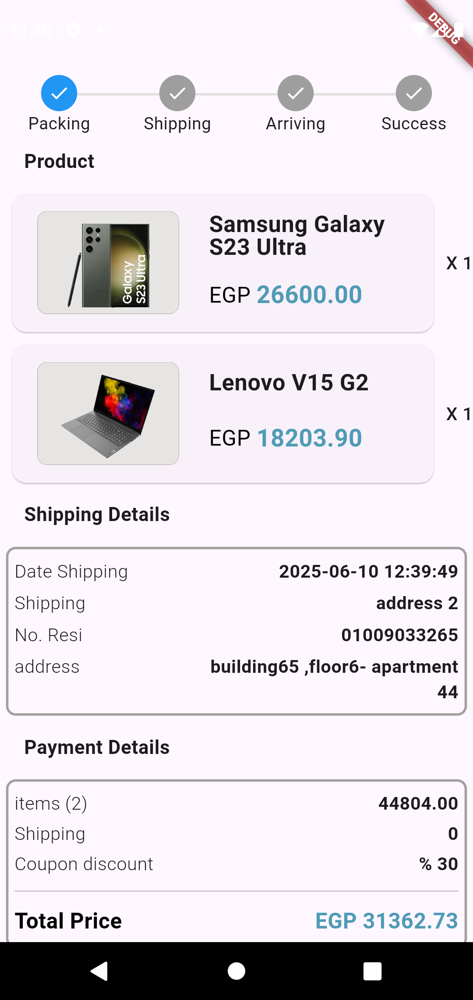</td>
    </tr>

   <tr>
  <td>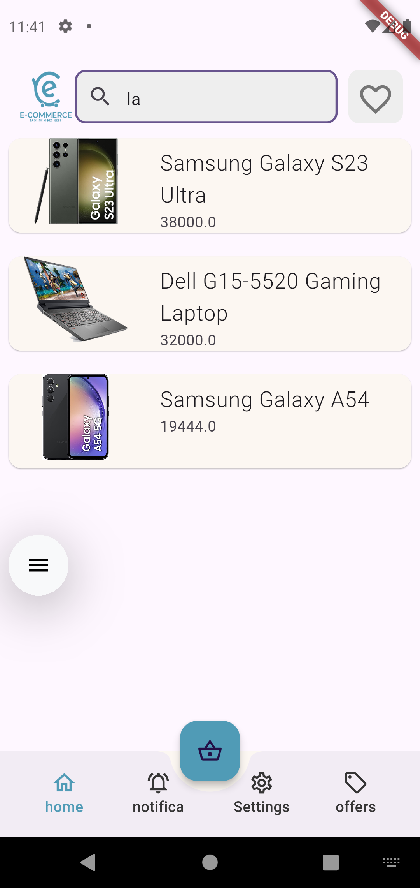</td>
    <td>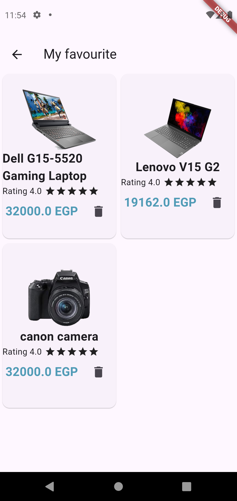</td>
     
    </tr>
    

  </table>
